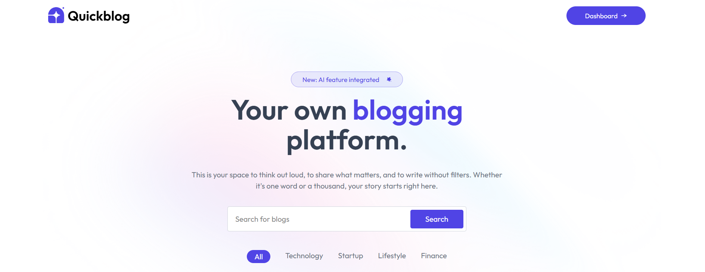
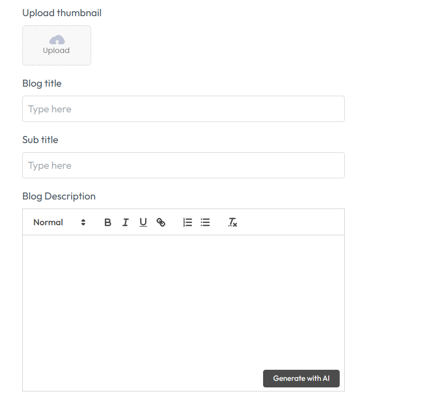
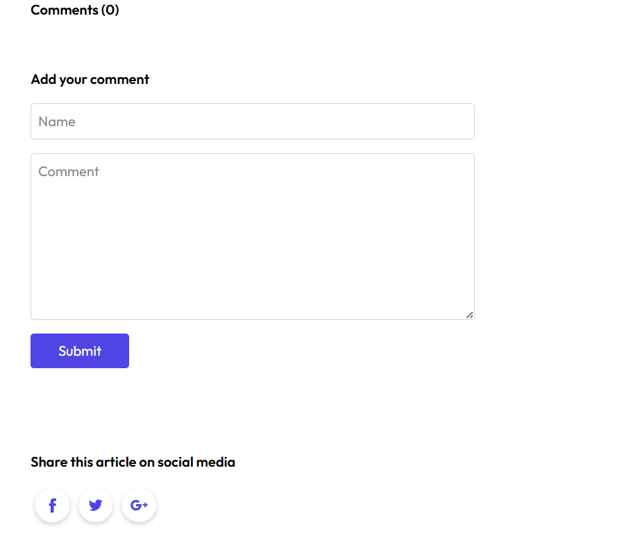
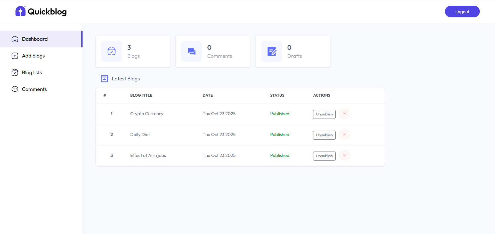

# QuickBlog

**QuickBlog** is a full-stack blogging platform that lets users create, explore, and share blogs across categories like tech, fitness, lifestyle, and more.
Users can write posts with titles, subtitles, and images, and the app automatically generates blog descriptions using AI. It also supports commenting, deleting or unpublishing blogs, and browsing posts by category.

## Features

1. Create, read, and manage blogs
2. AI-generated blog descriptions
3. Upload images for blogs
4. Add and view comments
5. Browse blogs by category
6. Delete or unpublish your own blogs

## Tech Stack

1. Frontend: React, Vite, Tailwind CSS, JavaScript,HTML
2. Backend: Node.js, Express.js
3. Database: MongoDB
4. AI Integration: Google Gemini API
5. Image Management: ImageKit API

## Screenshots

  
   
 
 
      

>
